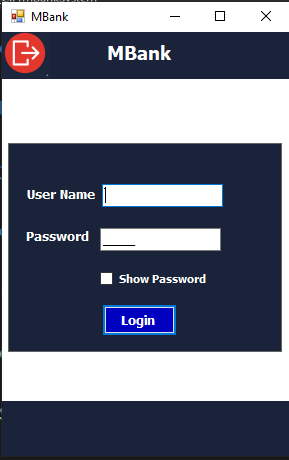

<div align="center">

# 🏦 MBank—v3.1.0

### Desktop Banking Simulation Application

A desktop banking management system developed with **C#**, **Windows Forms**, **ADO.NET**, and **SQL Server**, following a structured **Three-Tier Architecture**.

<br>

[](https://learn.microsoft.com/dotnet/csharp/)
[](https://dotnet.microsoft.com/)
[](https://learn.microsoft.com/dotnet/desktop/winforms/)
[](https://learn.microsoft.com/dotnet/framework/data/adonet/)
[](https://www.microsoft.com/sql-server)
[](#-architecture)
[](#-version)

<br>

[📖 About](#-about-the-project) ·
[🎯 Goals](#-project-goals) ·
[✨ Features](#-key-features) ·
[🏗️ Architecture](#️-architecture) ·
[🖥️ Screenshots](#️-screenshots) ·
[🛠️ Technologies](#️-technologies) ·
[📂 Structure](#-project-structure) ·
[🚀 Setup](#-getting-started)

</div>

---

<div align="center">

## 🏦 Application Preview


<br>

### MBank Dashboard

The main dashboard provides access to the core banking operations and management features.

<br>

[📸 View All Screenshots](Screenshots)

</div>

---

# 📖 About The Project

**MBank** is a desktop banking simulation application developed using **C#**, **Windows Forms**, **ADO.NET**, and **SQL Server**.

The project represents the latest stage of an incremental learning journey that evolved through several development stages.

The application started with an early **C++ implementation**, was later redesigned using **Object-Oriented Programming**, transitioned to **C#**, and eventually evolved into a database-driven application using **SQL Server**, **ADO.NET**, and a structured **Three-Tier Architecture**.

The current version, **v3.1.0**, focuses on building a more structured and maintainable banking system with dedicated layers for presentation, business logic, and data access.

---

# 🎯 Project Goals

The project was developed with the following goals:

- Apply **Object-Oriented Programming** in a practical application.
- Build a complete desktop banking simulation.
- Practice working with **C# and Windows Forms**.
- Replace file-based data handling with a relational database.
- Practice database communication using **ADO.NET**.
- Apply **SQL Server** in a real-world style application.
- Separate responsibilities using **Three-Tier Architecture**.
- Build reusable Business Logic and Data Access components.
- Implement practical validation and data-integrity rules.
- Practice authentication, authorization, transactions, and system logging.

---

# ✨ Key Features

## 👥 Manage Clients

The client-management module provides complete management of bank clients.

### Includes

- CRUD Operations
- Duplicate Account Number Prevention
- Live Search
- Soft Delete
- Inactive Account Status
- Country-based Location Integration
- Country-aware Phone Number Validation

### Data Integrity

The system prevents duplicate account numbers and preserves historical client information by using an `Inactive` state instead of permanently removing records.

---

## 🔐 Manage Users

The system provides a dedicated user-management module.

### Includes

- User creation
- User modification
- User deletion
- User lookup
- User permissions
- Access control

### 🔒 Admin Protection

The primary `Admin` account is protected from unauthorized deletion or critical modification.

The permission system allows operational privileges to be controlled according to the user's role.

---

## 💳 Transactions

The banking system supports core monetary operations.

### Supported Operations

- Deposit
- Withdraw
- Account-to-account Transfer

Transactions are connected to the central bank vault, allowing the system to reflect monetary movements and maintain a transfer history.

---

## 🏦 Vault Management

The system maintains a central bank vault that reflects monetary transactions.

The vault interface provides a live view of the bank's monetary state and is integrated with transaction operations.

```text
Deposit
   │
   ▼
Client Account
   │
   ▼
Bank Vault
```

Withdrawals and transfers are similarly reflected through the transaction and vault mechanisms.

---

## 📝 Login Register

The application records user authentication and system-access events.

The Login Register provides an activity trail that can be used to track system access.

```text
User Login
    │
    ▼
Authentication
    │
    ▼
Login Register
```

---

## 💱 Currency Exchange

The Currency Exchange module provides functionality for managing and converting currencies.

### Includes

- Currency CRUD Operations
- Currency Management
- Exchange Rate Calculation
- Currency Calculator
- Controlled Currency Creation

Only the `Admin` user is allowed to introduce new currencies due to the sensitive nature of the operation.

---

## ⚠️ Error Logging

The application automatically records application errors and exceptions into a dedicated log file.

This provides a mechanism for:

- Error tracking
- Diagnostics
- Troubleshooting
- Application monitoring

```text
Application Error
       │
       ▼
Exception Handling
       │
       ▼
Error Log
```

---

# 🔄 Main Application Workflow

A simplified representation of the main banking workflow:

```text
                    USER
                     │
                     ▼
              ┌─────────────┐
              │    Login    │
              └──────┬──────┘
                     │
                     ▼
              ┌─────────────┐
              │  Dashboard  │
              └──────┬──────┘
                     │
        ┌────────────┼─────────────┐
        │            │             │
        ▼            ▼             ▼
     Clients       Users      Transactions
        │            │             │
        │            │             ▼
        │            │           Vault
        │            │
        │            ▼
        │        Permissions
        │
        ▼
   Account Data
```

---

# 🏗️ Architecture

The project follows a **Three-Tier Architecture** that separates the application into three primary layers.

```text
┌──────────────────────────────────────────────┐
│              🖥️ PRESENTATION               │
│              Project_Bank_C                 │
│                                              │
│       Windows Forms • User Interface        │
└──────────────────────┬───────────────────────┘
                       │
                       ▼
┌──────────────────────────────────────────────┐
│             ⚙️ BUSINESS LOGIC               │
│             clsBussinseLibrary              │
│                                              │
│     Business Rules • Validation • Logic     │
└──────────────────────┬───────────────────────┘
                       │
                       ▼
┌──────────────────────────────────────────────┐
│              🗄️ DATA ACCESS                 │
│             clsDataAccessLibrary             │
│                                              │
│        ADO.NET • SQL Server • CRUD          │
└──────────────────────┬───────────────────────┘
                       │
                       ▼
                  💾 SQL Server
```

---

## 🖥️ Presentation Layer

### `Project_Bank_C`

The Presentation Layer contains the Windows Forms interface and is responsible for interaction with the user.

The project contains forms for the main banking operations, including:

```text
Project_Bank_C
│
├── Login
├── Dashboard
├── Bank Interface
├── Manage Users
├── Transactions
├── Currency Exchange
├── Add Currency
├── Properties
├── Resources
└── Database
```

Main forms include:

```text
frmLogin
FrmBankSystem
FrmInterFace
FrmManageUser
FrmTransaction
frmCurrencyExchange
FrmAddCurrency
```

---

## ⚙️ Business Logic Layer

### `clsBussinseLibrary`

The Business Logic Layer contains the application's business rules and domain operations.

Main components include:

```text
clsCurrenciesExchange
clsDatabaseInitializer
clsLoginRegister
clsManageUsers
clsManagementClient
clsTransaction
```

The Business Layer acts as the bridge between the Presentation Layer and Data Access Layer.

---

## 🗄️ Data Access Layer

### `clsDataAccessLibrary`

The Data Access Layer is responsible for communication with SQL Server through ADO.NET.

Main components include:

```text
clsConnectionString
clsCurrencyExchange
clsDDatabaseInitializer
clsLoginRegister
clsManageClient
clsManageUser
clsTransaction
```

This layer isolates database-related operations from the application's business rules and user interface.

---

## 👤 User Session

### `clsUserSession`

The project also contains a dedicated `clsUserSession` project responsible for maintaining the current authenticated user's session information.

```text
clsUserSession
└── clsUserSession.cs
```

This allows the application to maintain information about the currently active user throughout the application lifecycle.

---

# 🔗 Layer Communication

The application follows a controlled communication path:

```text
                    USER
                     │
                     ▼
          ┌─────────────────────┐
          │  Presentation Layer │
          │    Project_Bank_C   │
          └──────────┬──────────┘
                     │
                     ▼
          ┌─────────────────────┐
          │  Business Layer     │
          │ clsBussinseLibrary  │
          └──────────┬──────────┘
                     │
                     ▼
          ┌─────────────────────┐
          │ Data Access Layer   │
          │ clsDataAccessLibrary│
          └──────────┬──────────┘
                     │
                     ▼
                SQL Server
```

The `clsUserSession` component works alongside the application layers to maintain the active user's session state.

---

# 🗄️ Database & Data Access

The project uses **SQL Server** as its relational database and **ADO.NET** as the data-access technology.

The repository contains a dedicated database area within the main application project:

```text
Project_Bank_C
└── Database
```

The Data Access Layer provides dedicated classes for the application's major database operations.

```text
SQL Server
    ▲
    │
    │ ADO.NET
    │
clsDataAccessLibrary
    ▲
    │
    │ Business Operations
    │
clsBussinseLibrary
    ▲
    │
    │ User Interaction
    │
Project_Bank_C
```

---

# 🖥️ Screenshots

Explore the main interfaces of the MBank application.

<div align="center">

### 📊 Dashboard


<br>

<sub><b>Main Dashboard</b> — Central interface for accessing the banking system.</sub>

</div>

<br>

<table>
<tr>
<td width="50%" align="center">

### 🔐 Login



<sub>Application authentication interface.</sub>

</td>

<td width="50%" align="center">

### 👥 Manage People


<sub>Client management interface.</sub>

</td>
</tr>

<tr>
<td width="50%" align="center">

### 💱 Currency Exchange


<sub>Currency management and exchange interface.</sub>

</td>

<td width="50%" align="center">

### 🏦 Vault


<sub>Central bank vault monitoring interface.</sub>

</td>
</tr>
</table>

<br>

<div align="center">

📸 **[View the complete Screenshots Gallery](Screenshots)**

</div>

---

# 🛠️ Technologies

| Technology | Purpose |
|:--|:--|
| **C#** | Core programming language |
| **.NET Framework** | Application framework |
| **Windows Forms** | Desktop user interface |
| **ADO.NET** | Database connectivity and data access |
| **SQL Server** | Relational database management system |
| **OOP** | Application and domain design |
| **Three-Tier Architecture** | Separation of responsibilities |
| **Visual Studio** | Development environment |
| **Git & GitHub** | Version control and repository hosting |

---

# 🧠 Concepts Applied

## Programming Concepts

- Object-Oriented Programming
- Classes & Objects
- Encapsulation
- Abstraction
- Properties
- Constructors
- Enums
- Static Members
- Reusable Components

## Architecture Concepts

- Three-Tier Architecture
- Separation of Concerns
- Layered Design
- Business Logic Separation
- Data Access Separation
- Project-to-Project References

## Database Concepts

- SQL Server
- ADO.NET
- Database Connections
- CRUD Operations
- Relational Data Handling
- Data Integrity

## Security & Reliability

- Authentication
- Authorization
- User Permissions
- Admin Protection
- Login Activity Logging
- Error Logging
- Data Validation

---

# 📂 Project Structure

The repository is organized into separate projects according to their responsibilities:

```text
MBank-v3.1.0/
│
├── 📁 Project_Bank_C/
│   │
│   ├── 📁 Database/
│   ├── 📁 Images/
│   │   └── 📁 Countries/
│   ├── 📁 Properties/
│   ├── 📁 Resources/
│   ├── 📁 Screenshots/
│   │
│   ├── 📄 Form1.cs
│   ├── 📄 FrmBankSystem.cs
│   ├── 📄 FrmInterFace.cs
│   ├── 📄 FrmManageUser.cs
│   ├── 📄 FrmTransaction.cs
│   ├── 📄 frmCurrencyExchange.cs
│   ├── 📄 FrmAddCurrency.cs
│   ├── 📄 frmLogin.cs
│   ├── 📄 Program.cs
│   └── 📄 Project_Bank_C.csproj
│
├── 📁 clsBussinseLibrary/
│   │
│   ├── 📁 Properties/
│   ├── 📄 clsCurrenciesExchange.cs
│   ├── 📄 clsDatabaseInitializer.cs
│   ├── 📄 clsLoginRegister.cs
│   ├── 📄 clsManageUsers.cs
│   ├── 📄 clsManagementClient.cs
│   ├── 📄 clsTransaction.cs
│   └── 📄 clsBussinseLibrary.csproj
│
├── 📁 clsDataAccessLibrary/
│   │
│   ├── 📁 Properties/
│   ├── 📄 clsConnectionString.cs
│   ├── 📄 clsCurrencyExchange.cs
│   ├── 📄 clsDDatabaseInitializer.cs
│   ├── 📄 clsLoginRegister.cs
│   ├── 📄 clsManageClient.cs
│   ├── 📄 clsManageUser.cs
│   ├── 📄 clsTransaction.cs
│   └── 📄 clsDataAccessLibrary.csproj
│
├── 📁 clsUserSession/
│   │
│   ├── 📄 clsUserSession.cs
│   └── 📄 clsUserSession.csproj
│
├── 📁 Screenshots/
│   ├── 🖼️ Dashboard.png
│   ├── 🖼️ Login.png
│   ├── 🖼️ Manage-People.png
│   ├── 🖼️ CurrencyExchange.png
│   └── 🖼️ Vault.png
│
├── 📄 Project_Bank_C.sln
├── 📄 .gitignore
└── 📄 README.md
```

> Build-generated directories such as `bin` and `obj` are intentionally omitted from the documented structure.

---

# 🚀 Getting Started

## Prerequisites

Before running the project, make sure you have:

- Windows
- Visual Studio
- .NET Framework compatible with the project
- SQL Server
- SQL Server Management Studio

---

## 1️⃣ Clone the Repository

```bash
git clone https://github.com/mohammedabdullahnomanqaid-maker/MBank-v3.1.0.git
```

Then:

```bash
cd MBank-v3.1.0
```

---

## 2️⃣ Open the Solution

Open:

```text
Project_Bank_C.sln
```

using Visual Studio.

The solution contains:

```text
Project_Bank_C
clsBussinseLibrary
clsDataAccessLibrary
clsUserSession
```

---

## 3️⃣ Configure the Database

Review the database connection configuration located in:

```text
clsDataAccessLibrary
└── clsConnectionString.cs
```

Configure the connection according to your local SQL Server environment.

> ⚠️ Never publish real production credentials, usernames, or passwords in a public repository.

---

## 4️⃣ Prepare the Database

The repository contains a dedicated:

```text
Project_Bank_C
└── Database
```

directory.

Use the database resources provided by the project and make sure the required SQL Server database is available before running the application.

---

## 5️⃣ Build the Solution

From Visual Studio:

```text
Build
   ↓
Rebuild Solution
```

Make sure all projects build successfully.

---

## 6️⃣ Run the Application

Set:

```text
Project_Bank_C
```

as the startup project and run the application.

The application should open through the Login interface.

---

# 📈 Version

## `v3.1.0`

This repository represents **MBank Version 3.1.0**.

The project represents an advanced stage in the application's development journey, evolving from earlier C++ and file-based implementations into a C# desktop banking system backed by SQL Server and structured using Three-Tier Architecture.

---

# 🛣️ Development Journey

The project was developed incrementally through multiple stages:

```text
C++ Implementation
        │
        ▼
Object-Oriented Programming
        │
        ▼
C# Implementation
        │
        ▼
File-Based Storage
        │
        ▼
SQL Server
        │
        ▼
ADO.NET
        │
        ▼
Three-Tier Architecture
        │
        ▼
MBank v3.1.0
```

Each stage provided an opportunity to improve the project's architecture, maintainability, and practical implementation of software-development concepts.

---

# 🔮 Future Improvements

Potential future improvements include:

- Further UI/UX improvements
- Enhanced validation
- Improved error handling
- More advanced reporting
- Additional transaction features
- Enhanced security mechanisms
- More comprehensive testing
- Further architectural refactoring
- Improved configuration management
- Additional banking functionality

---

# 🎓 Learning Outcomes

This project provides practical experience with:

- Building a complete desktop banking application
- Applying Object-Oriented Programming
- Designing a multi-project solution
- Implementing Three-Tier Architecture
- Working with SQL Server
- Using ADO.NET for database access
- Designing Business Logic components
- Designing Data Access components
- Implementing authentication and authorization
- Managing user permissions
- Handling financial transactions
- Implementing logging mechanisms
- Applying data validation and integrity rules
- Working with Git and GitHub

---

# 📄 License

This project is open-source and available under the **MIT License**.

You are free to use, modify, and distribute the project, provided that proper copyright and attribution to the original author are maintained.

---

# 👨‍💻 Author

<div align="center">

### Mohammed Abdullah Noman Qaid Mohammed 

**Computer Science Student — Taiz University**

<br>

[](https://www.linkedin.com/in/dev-moh-noman/)
[](mailto:mohammedabdullahnomanqaid@gmail.com)

<br>

**Special Acknowledgment**

Developed under the roadmap and guidance of  
**Dr. Mohammed Abu-Hadhoud — Programming Advices**

</div>

---

# ⭐ Support

If you find this project useful or interesting, consider giving the repository a ⭐ on GitHub.

Your feedback and suggestions are always welcome.

---

<div align="center">

**MBank — Banking Management System**

Built with **C# · Windows Forms · ADO.NET · SQL Server · OOP · Three-Tier Architecture**

</div>
